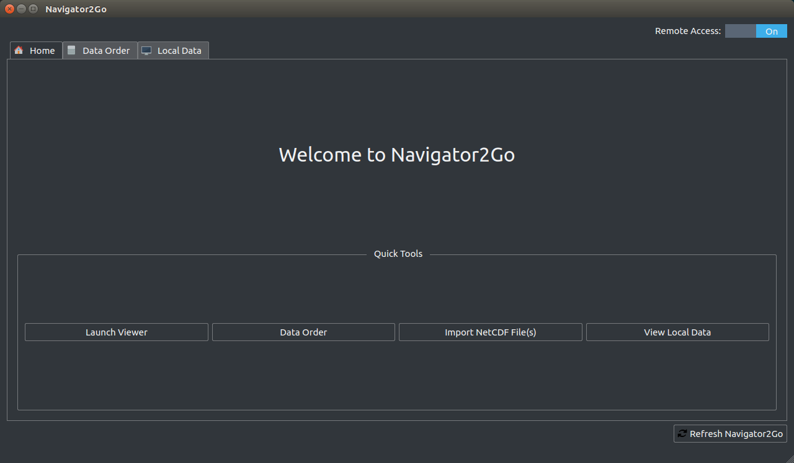

# Navigator2Go

[](https://www.codacy.com/app/htmlboss/Ocean-Navigator-Config-Tool?utm_source=github.com&amp;utm_medium=referral&amp;utm_content=DFO-Ocean-Navigator/Ocean-Navigator-Config-Tool&amp;utm_campaign=Badge_Grade)
[](https://www.codefactor.io/repository/github/dfo-ocean-navigator/navigator2go)

Tool to manage your local Ocean Navigator installation.

[Navigator2Go Manual](https://dfo-ocean-navigator.github.io/Navigator2GoTutorial/)

[Code Documentation](https://dfo-ocean-navigator.github.io/Navigator2Go/)



### Features
* Control local gUnicorn and Apache Tomcat (THREDDS) servers.
* Apply the full power of the Ocean Navigator to your own data by importing as a netCDF.
* Customize your Navigator with easy-to-use configuration editors.
* Download netCDF datasets from remote Navigator servers.
* Very high performance.
* Schedule jobs to update your data.
* Multi-threading where needed.

## Getting Started

For more details about the following build process go here: [http://doc.qt.io/qt-5/linux-building.html](http://doc.qt.io/qt-5/linux-building.html)

1. Install GCC 7 or newer to get access to all the latest and greatest C++ 17 features.
2. Install dependencies using the following:
```shell
sudo apt install build-essential valgrind zlib1g-dev libgl1-mesa-dev libfontconfig1-dev libfreetype6-dev libx11-dev libxext-dev libxfixes-dev libxi-dev libxrender-dev libxcb1-dev libx11-xcb-dev libxcb-glx0-dev libxcb-keysyms1-dev libxcb-image0-dev libxcb-shm0-dev libxcb-icccm4-dev libxcb-sync0-dev libxcb-xfixes0-dev libxcb-shape0-dev libxcb-randr0-dev libxcb-render-util0-dev doxygen-gui
```
3. Go ahead and clone this repository into a directory of your choice:
```shell
git clone https://github.com/DFO-Ocean-Navigator/Navigator2Go.git
```
4. Install Qt 5.11 Open Source: [https://www.qt.io/download](https://www.qt.io/download). Make sure you also check "Sources" when using the installer.
5. Navigate to the Qt installation directory.
6. Run `mkdir static`. Now we need to build Qt as a static library. This allows us to create a one-file executable.
7. `cd 5.11.0/Src/`
8. Run the following to configure Qt:
```shell
./configure -static -release -verbose -opensource -confirm-license -prefix $QT_INSTALL_DIRECTORY/static -qt-xcb -no-glib -no-pulseaudio -no-alsa -opengl desktop -nomake examples -nomake tests -skip wayland -skip qtdeclarative -static-runtime
```
9. Then run: `make -j12 clean`. The `-j12` tells make how many jobs it should spawn to build the project. Normally the number specified is the number of physical cores in your system.
10. Run `make -j12`.
11. Assuming no errors occoured (which shouldn't), finally run `make -j12 install`.
12. Et Voila! Vous avez terminé!

## Building for Release
So, you've made some changes to my lovely code that made it even more awesome. Time to send it out to the masses.
1. Navigate to the source folder `Navigator2Go/app/`.
2. Run `./Build.sh`.
3. Fix any compile errors that crop up and run the above again.
4. `cd ../build/`.
5. `./Navigator2Go`.
6. To package it for uploading to Github, `tar zcvf Navigator2Go.tar.gz Navigator2Go`. Do not change the tar.gz file name otherwise the installation script WILL fail.
7. Go to Github and create a new release.

## Updating Code Documentation
1. To update the Github pages, run `doxywizard` from your terminal.
2. Open the doxyfile in the `app/` folder and increment the version number if needed to match VERSION.txt.
3. Click the Run tab and then click on the Run Doxygen button.
4. Commit and push your changes. The site will update automatically.

## Incrementing Version Number
The program's version number is stored in `VERSION.txt`. This is included in `Config_Tool.pro` to make the number accessible to `qmake` and to C++.
DO NOT remove or move this file, since this file is queried by the Navigator2Go update function.
After changing the number as needed:
* Run qmake from Qt Creator.
* Clean and re-build the project.
* Run the output binary and verify the number by going to Help -> About.
